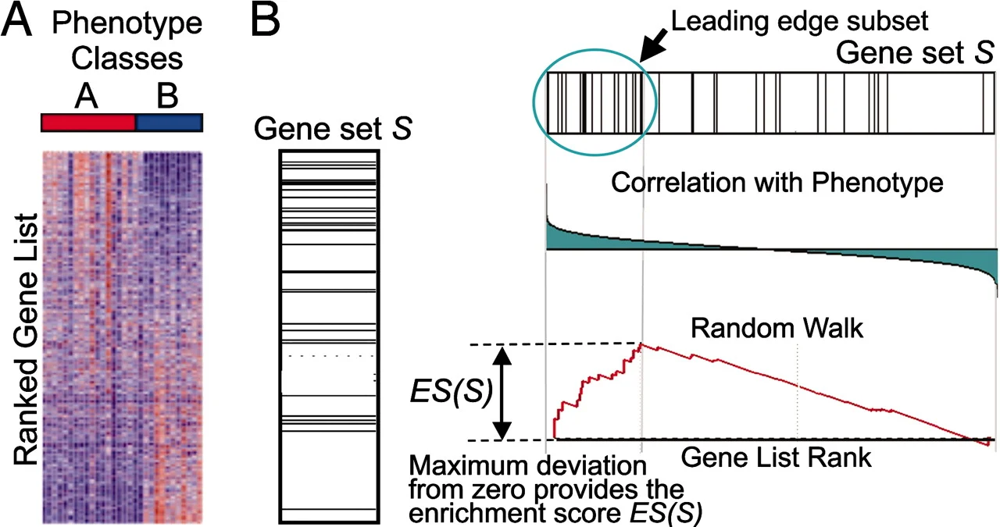

# Introducción a `clusterProfiler`

## Enriquecimientos 

`Un análisis de enriquecimiento funcional suele aplicarse para extraer información biológica relevante ya sea de una lista filtrada de genes relevantes.` El ejemplo más conocido de esta lista podría ser los genes diferencialmente expresados resultado de un análisis de Expresión diferencial.

Si bien hay varios métodos para hacer enriquecimiento[^1], los dós métodos más comunes son el Análisis de sobrerepresentación (*Over-representation analysis* o ORA) y el Análisis de Enriquecimiento de Conjuntos de Genes (*Gene Set Enrichment Analysis* o GSEA). Ambos incluidos en `clusterProfiler`.


| Análisis | Lo que require de entrada | Como luce la salida |  ✅ Pros | ⚠️ Cons |
| -------- | :-----------------------: | :-----------------: | :-----: | :-----: |
| ORA (Over-representation Analysis) | Una lista de genes (no se requeiren estadísticos) | Una prueba hipergeométrica por vía | - Sencillo <br> - Barato computacionalmente para calcular *p*-values | - Ignora estadísticas asociadas con los genes y requiere puntos de corte arbitrarios <br> - Asume independencia de genes y pathways |
| GSEA (Gene Set Enrichment Analysis) | Una lista de IDs de genes con un valor estadístico por gen | Un puntaje de enriquecimiento (*enrichment score* ES) por vía | - Incluye todos los genes (Sin puntos de corte arbitrarios) <br> |  - Las permutaciones pueden ser computacionalmente costosas <br> - No considera sobrelape de vías |


## *Over-representation analysis*


## *Gene Set Enrichment Analysis*

[Video sobre GSEA](https://youtu.be/bT00oJh2x_4)



### Enrichr

Herramienta en linea para hacer ORA
https://maayanlab.cloud/Enrichr/


### Entonces ¿Para qué queremos clusterProfiler?

## GO *Over-representation analysis* con `clusterProfiler`

### Instalar y cargar paquetes
```r
#BiocManager::install("clusterProfiler")
#BiocManager::install("pathview")
library(clusterProfiler)
library(tidyverse)
```

### Anotación
Vamos a usar los genes diferencialmente expresados del trabajo [*The regulatory landscape of retinoblastoma: a pathway analysis perspective*](https://doi.org/10.6084/m9.figshare.c.5975228), por lo que usaremos la anotación de humano "org.Hs.eg.db". Puedes ver las anotaciones disponibles [aquí](http://bioconductor.org/packages/release/BiocViews.html#___OrgDb).

```r
#BiocManager::install("org.Hs.eg.db", character.only = TRUE)
library("org.Hs.eg.db", character.only = TRUE)
```

### Preparar entrada

```r
# Lectura de la tabla de genes diferencialemente expresados
degs = readRDS("data/degs.RDS")

# necesitamos el log2 fold change 
original_gene_list <- degs$logFC

# Nombramos el vector
names(original_gene_list) <- degs$ESGN

# eliminamos cualquier NA 
gene_list<-na.omit(original_gene_list)

# odernamos la lista en orden decreciente (requerido por clusterProfiler)
gene_list = sort(gene_list, decreasing = TRUE)

# extraemos los genes significativos (p ajustada < 0.05)
sig_genes_df = subset(degs, adj.P.Val < 0.05)

# para los resultados significativos, queremos filtrar por log2fold change
genes <- sig_genes_df$logFC

# nombramos el vector
names(genes) <- sig_genes_df$ESGN

# omitimos posibles NAs
genes <- na.omit(genes)

# filtramos por mínimo log2fold change (log2FoldChange > 2)
genes <- names(genes)[abs(genes) > 2]
```

### Crear objeto enrichGO

Parámetros:  
  
**Ontology** opciones: "BP", "MF" o "CC"  
**keyType** Esta puede variar depepndiendo de la anotación (gene ids). Por ejemplo para *"org.Hs.eg.db"*, las opciones son:   
  
<p style='text-align: justify;'> "ACCNUM"       "ALIAS"        "ENSEMBL"      "ENSEMBLPROT"  "ENSEMBLTRANS" "ENTREZID"     "ENZYME"       "EVIDENCE"     "EVIDENCEALL" </p>
<p style='text-align: justify;'> "GENENAME" "GENETYPE" "GO" "GOALL"        "IPI"          "MAP"          "OMIM"         "ONTOLOGY"     "ONTOLOGYALL" </p>
<p style='text-align: justify;'> "PATH"         "PFAM"         "PMID"         "PROSITE"      "REFSEQ"       "SYMBOL" "UCSCKG"       "UNIPROT" </p>
  
Puedes checar las opciones de la anotación de tu organismo usando la función `keytypes`, por ejemplo `keytypes(org.Hs.eg.db)`. 

#### Create the object

```r
go_enrich <- enrichGO(gene = genes,
                      universe = names(gene_list),
                      OrgDb = org.Hs.eg.db, 
                      keyType = 'ENSEMBL',
                      readable = TRUE,
                      ont = "BP",
                      pvalueCutoff = 0.05, 
                      qvalueCutoff = 0.10)
```
### Output

#### Table of results
```r
head(go_enrich)
```

### Upset Plot

Enfatiza el sobrelape de genes a lo largo de los diferentes set de genes.

```r
#BiocManager::install("enrichplot")
library(enrichplot)
upsetplot(go_enrich)
```

### Barplot

```r
barplot(go_enrich, 
        drop = TRUE, 
        showCategory = 10, 
        title = "GO Biological Pathways",
        font.size = 8)
```

### Dotplot
```r
dotplot(go_enrich)
```

## KEGG *Over-representation analysis*

For KEGG pathway enrichment using the `gseKEGG()` function, we need to convert id types. We can use the `bitr` function for this (included in clusterProfiler). It is normal for this call to produce some messages / warnings. 

In the `bitr` function, the param `fromType` should be the same as `keyType` from the `gseGO` function above (the annotation source). This param is used again in the next two steps: creating `dedup_ids` and `df2`.  

`toType` in the `bitr` function has to be one of the available options from `keyTypes(org.Dm.eg.db)` and must map to one of 'kegg', 'ncbi-geneid', 'ncib-proteinid' or 'uniprot' because `gseKEGG()` only accepts one of these 4 options as it's `keytype` parameter. In the case of org.Dm.eg.db, none of those 4 types are available, but 'ENTREZID' are the same as ncbi-geneid for org.Dm.eg.db so we use this for `toType`. 

As our intial input, we use `original_gene_list` which we created above.

## Prepare Data
```{r}
# Convert gene IDs for enrichKEGG function
# We will lose some genes here because not all IDs will be converted
ids<-bitr(names(original_gene_list), fromType = "ENSEMBL", toType = "ENTREZID", OrgDb="org.Dm.eg.db")

# remove duplicate IDS (here I use "ENSEMBL", but it should be whatever was selected as keyType)
dedup_ids = ids[!duplicated(ids[c("ENSEMBL")]),]

# Create a new dataframe df2 which has only the genes which were successfully mapped using the bitr function above
df2 = df[df$X %in% dedup_ids$ENSEMBL,]

# Create a new column in df2 with the corresponding ENTREZ IDs
df2$Y = dedup_ids$ENTREZID

# Create a vector of the gene unuiverse
kegg_gene_list <- df2$log2FoldChange

# Name vector with ENTREZ ids
names(kegg_gene_list) <- df2$Y

# omit any NA values 
kegg_gene_list<-na.omit(kegg_gene_list)

# sort the list in decreasing order (required for clusterProfiler)
kegg_gene_list = sort(kegg_gene_list, decreasing = TRUE)

# Exctract significant results from df2
kegg_sig_genes_df = subset(df2, padj < 0.05)

# From significant results, we want to filter on log2fold change
kegg_genes <- kegg_sig_genes_df$log2FoldChange

# Name the vector with the CONVERTED ID!
names(kegg_genes) <- kegg_sig_genes_df$Y

# omit NA values
kegg_genes <- na.omit(kegg_genes)

# filter on log2fold change (PARAMETER)
kegg_genes <- names(kegg_genes)[abs(kegg_genes) > 2]

```
## Create enrichKEGG object
**organism** KEGG Organism Code: The full list is here: https://www.genome.jp/kegg/catalog/org_list.html (need the 3 letter code). I define this as `kegg_organism` first, because it is used again below when making the pathview plots.  
**keyType** one of 'kegg', 'ncbi-geneid', 'ncib-proteinid' or 'uniprot'.  
```{r echo=TRUE}
kegg_organism = "dme"
kk <- enrichKEGG(gene=kegg_genes, universe=names(kegg_gene_list),organism=kegg_organism, pvalueCutoff = 0.05, keyType = "ncbi-geneid")
head(kk)
```


[^1]: Para más detalles ver: [Gómez-Romero, *et al.* (**2021**) "Bioinformatics of Functional Categories Enrichment" in *Bioinformatics and Human Genomics Research* eBook ISBN: 9781003005926](https://www.taylorfrancis.com/chapters/edit/10.1201/9781003005926-14/bioinformatics-functional-categories-enrichment-laura-g%C3%B3mez-romero-hugo-tovar-enrique-hern%C3%A1ndez-lemus).